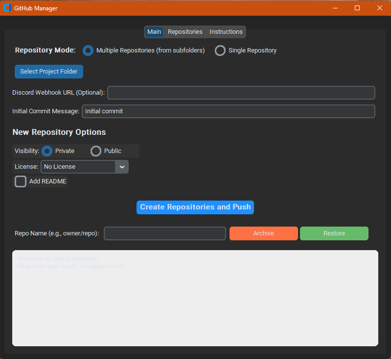

# GitHub Manager (GitHub-Automation)

[](https://www.python.org/)
[](LICENSE)

**A desktop application built with Python and CustomTkinter to automate common GitHub repository management tasks using the GitHub CLI (`gh`).**

---

## Table of Contents

1.  [Overview](#overview)
2.  [Problem Solved](#problem-solved)
3.  [Target Audience](#target-audience)
4.  [Features](#features)
5.  [Screenshots](#screenshots)
6.  [Technology Stack](#technology-stack)
7.  [File Structure](#file-structure)
8.  [Prerequisites](#prerequisites)
9.  [Installation & Setup](#installation--setup)
10. [Usage](#usage)
11. [Configuration](#configuration)
12. [Troubleshooting](#troubleshooting)
13. [Contributing](#contributing)
14. [Future Plans](#future-plans)
15. [Acknowledgements](#acknowledgements)
16. [License](#license)

---

## Overview

GitHub Manager provides a graphical user interface (GUI) to simplify the process of creating, managing, and interacting with your GitHub repositories. It leverages the power of the official GitHub CLI (`gh`) in the background, offering a user-friendly alternative to command-line operations for common tasks. It's designed to streamline workflows, especially when dealing with multiple projects or initializing new repositories from existing local folders.

## Problem Solved

Managing numerous GitHub repositories, especially initializing them from local projects, often involves repetitive `git` and `gh` commands. This tool aims to:

*   Reduce the command-line complexity for common repository creation and management tasks.
*   Provide a visual interface for users who prefer GUIs over terminals.
*   Automate the process of initializing local folders as Git repositories and pushing them to GitHub.
*   Streamline the setup process by checking for prerequisites and guiding users through GitHub CLI authentication.

## Target Audience

This tool is beneficial for:

*   Developers managing multiple small projects or code snippets they want to quickly push to GitHub.
*   Students learning Git and GitHub who might find a GUI less intimidating.
*   Users who frequently initialize new repositories from existing local project folders.
*   Anyone who prefers a graphical interface for basic GitHub tasks like creation, archiving, and listing repositories.

## Features

*   **Graphical User Interface**: Clean and intuitive interface built with CustomTkinter.
*   **Repository Creation Modes**:
    *   **Single Repository**: Create a new GitHub repository from a single selected local folder.
    *   **Multiple Repositories**: Create multiple GitHub repositories simultaneously, one for each subfolder within a selected parent directory (skips common non-project folders like `.git`, `build`, `dist`, `__pycache__`).
*   **Automated Git & GitHub Workflow**:
    *   Initializes local Git repository (`git init`).
    *   Creates the corresponding remote repository on GitHub (`gh repo create`).
    *   Sets up the remote origin (`git remote add origin`).
    *   Handles potential conflicts by pulling remote README/License files before the first local commit (`git pull origin main --allow-unrelated-histories`).
    *   Stages all local files (`git add .`).
    *   Makes an initial commit with a customizable message (`git commit`).
    *   Pushes the initial commit and project files to GitHub (`git push -u origin main`).
*   **Repository Options**: Configure visibility (Public/Private), add a standard LICENSE file, and optionally include a README.md during creation via GitHub CLI flags.
*   **Prerequisite Management**:
    *   Automatically checks for required software (GitHub CLI) and Python packages (`customtkinter`, `CTkListbox`, `requests`).
    *   Prompts users to automatically install missing Python packages via pip.
    *   Provides clear instructions and links for manually installing GitHub CLI if missing.
*   **Integrated GitHub Login**:
    *   Checks if the user is logged into GitHub CLI (`gh auth status`).
    *   If not logged in, provides a guided, interactive login process (`gh auth login`) directly within the application, showing command output.
*   **Repository Management**:
    *   Archive (`gh repo archive`) and restore (`gh repo unarchive`) repositories directly from the GUI.
    *   List repositories (`gh repo list`) associated with your GitHub account in a dedicated tab.
    *   (Basic) Pull/Push functionality for selected repositories (Note: This clones, performs action, then removes the clone).
*   **Safety**: Creates a local backup copy of the project folder(s) inside a `repo_backup` directory within the original project before initializing repositories.
*   **Error Handling**: Displays errors from `git` or `gh` commands directly in the output area. Logs critical Python errors to `debug.log`.
*   **Discord Integration**: Optionally send logs of actions performed (commands run and their results) to a specified Discord webhook URL.
*   **Built-in Instructions**: A dedicated tab provides detailed usage instructions copied from this README.

## Screenshots

*(Add screenshots of the application here)*

*   *Main Tab Interface*
    ```
    
    ```
*   *Repositories Tab*
    ```
    [Image: Coming Soon!]
    ```
*   *Prerequisite Check Dialog*
    ```
    [Image: Coming Soon!]
    ```
*   *GitHub Login Dialog*
    ```
    [Image: Coming Soon!]
    ```
*   *GitHub Login Process Window*
    ```
    [Image: Coming Soon!]
    ```

## Technology Stack

*   **Core Language**: Python 3.x
*   **GUI Framework**: CustomTkinter
*   **GitHub Interaction**: GitHub CLI (`gh`) executed via Python's `subprocess` module.
*   **HTTP Requests**: `requests` library (for Discord webhook).
*   **Packaging**: PyInstaller (for creating the `.exe` standalone executable).
*   **Listbox**: CTkListbox (with a basic fallback implementation if the package is missing).

## File Structure

```
GitHub-Automation/
│
├── LICENSE                 # Project license file
├── README.md               # This README file
│
└── PY/                     # Main directory for Python code and assets
    │
    ├── github_manager.py   # Main application script
    ├── github_manager.spec # PyInstaller specification file (for building EXE)
    ├── github_manager_exe.bat # Batch script to build the executable
    ├── github_cli_login.bat # (Helper script, potentially for manual login)
    ├── debug.log           # Log file for Python errors
    │
    ├── assets/             # Application assets
    │   └── Digital-Synergy.ico # Application icon
    │
    ├── build/              # PyInstaller build artifacts (temporary)
    ├── dist/               # PyInstaller output directory
    │   └── GitHub_Manager/
    │       └── github_manager.exe # The final executable application
    │
    └── repo_backup/        # Automatically created backup of processed folders (inside original project location)
```

## Prerequisites

Before running GitHub Manager, ensure you have the following installed:

1.  **Python 3.x**: Download from [python.org](https://www.python.org/). Make sure Python is added to your system's PATH during installation.
2.  **GitHub CLI (`gh`)**: Download and install from [cli.github.com](https://cli.github.com/). The application will prompt you if it's missing but requires manual installation. Verify installation by opening a terminal and running `gh --version`.

*Note: Required Python packages (`customtkinter`, `CTkListbox`, `requests`) will be checked and installed automatically by the application if missing (using `pip`).*

## Installation & Setup

1.  **Clone the repository:**
    ```bash
    git clone https://github.com/Digital-Synergy2024/GitHub-Automation.git
    cd GitHub-Automation
    ```
2.  **Build the Executable (Recommended Method):**
    *   Navigate to the `PY` directory: `cd PY`
    *   Run the build script by double-clicking `github_manager_exe.bat` or running it from the command line:
        ```bash
        .\github_manager_exe.bat
        ```
    *   This script performs the following steps:
        *   Checks if Python is available in the PATH.
        *   Installs `PyInstaller` using pip if it's not already installed.
        *   Installs required Python packages (`customtkinter`, `CTkListbox`, `requests`) using pip.
        *   Builds the executable using PyInstaller and the `github_manager.spec` file (which includes the application icon and necessary data).
        *   The final `github_manager.exe` and its dependencies will be placed inside the `PY/dist/GitHub_Manager/` directory.
3.  **Run the Application:**
    *   Navigate to `PY/dist/GitHub_Manager/`.
    *   Double-click `github_manager.exe` to launch the application.

*(**Alternative - Running from Source**):*
*   *Manually install prerequisites:*
    ```bash
    pip install customtkinter CTkListbox requests
    ```
*   *Run the script:*
    ```bash
    python PY/github_manager.py
    ```
    *(Note: This method requires Python and the packages to be installed directly on your system).*

## Usage

1.  **Launch GitHub Manager**: Run `github_manager.exe`.
2.  **Prerequisites Check**: The application automatically checks for GitHub CLI and required Python packages.
    *   If Python packages are missing, a dialog will appear asking for permission to install them via pip. Click "Install Now".
    *   If GitHub CLI is missing, a dialog will appear instructing you to install it manually from [cli.github.com](https://cli.github.com/) and then restart the application.
3.  **GitHub Login**: The application checks your GitHub CLI authentication status (`gh auth status`).
    *   If you are already logged in, the main application window will load.
    *   If not logged in, a dialog appears with instructions. Click "Login Now". A new window will open showing the interactive output of the `gh auth login` command. Follow the prompts within that window (this usually involves opening a web browser and entering a code). Once login is successful, close the login window to proceed to the main application.
4.  **Main Tab**:
    *   **Repository Mode**: Choose "Single Repository" (for the selected folder) or "Multiple Repositories" (for subfolders within the selected folder).
    *   **Select Project Folder**: Click the button and browse to the folder you want to process. The path will appear next to the button.
    *   **Discord Webhook URL (Optional)**: Paste a Discord webhook URL if you want action logs sent to a channel.
    *   **Initial Commit Message**: Enter the desired message for the first commit (defaults to "Initial commit").
    *   **New Repository Options**:
        *   *Visibility*: Choose Private or Public.
        *   *License*: Select a license from the dropdown (e.g., MIT, Apache 2.0) or "No License".
        *   *Add README*: Check the box to have GitHub initialize the repository with a README.md file.
    *   **Create Repositories and Push**: Click this button to start the process. The application will:
        *   Create a backup in `repo_backup`.
        *   Perform the `git init`, `gh repo create`, `git remote add`, `git pull`, `git add`, `git commit`, and `git push` sequence for each repository (either the single selected folder or each valid subfolder).
        *   Display progress and status messages in the output area at the bottom.
    *   **Archive/Restore**: Enter a repository name in `owner/repo` format (e.g., `Digital-Synergy2024/GitHub-Automation`) and click "Archive" or "Restore".
5.  **Repositories Tab**:
    *   **Refresh List**: Click to fetch a list of repositories associated with your authenticated GitHub account.
    *   Select a repository from the list by clicking on it.
    *   Use "Pull Selected" or "Push Selected" for basic remote interactions (note the implementation details mentioned in Features).
6.  **Instructions Tab**: Refer to this tab for a quick reference guide within the application.

## Configuration

*   **`debug.log`**: Located in the `PY` directory. This file logs any critical Python errors encountered during the application's execution. Check this file if the application crashes or behaves unexpectedly without a clear error message in the GUI.
*   **`github_manager.spec`**: Located in the `PY` directory. This is the PyInstaller specification file used by the `github_manager_exe.bat` script to build the executable. Advanced users can modify this file to customize the build process (e.g., add other data files, change build options).

## Troubleshooting

*   **"gh command not found" / "'gh' is not recognized..."**:
    *   Ensure GitHub CLI is installed correctly from [cli.github.com](https://cli.github.com/).
    *   Verify that the GitHub CLI installation directory is included in your system's PATH environment variable. You might need to restart your system or terminal after modifying the PATH.
    *   Restart the GitHub Manager application after installing/fixing the PATH.
*   **Authentication Errors / Login Issues**:
    *   Try running `gh auth login` manually in your command prompt or terminal to ensure you can authenticate successfully outside the application.
    *   Check your internet connection.
    *   Ensure you are following the browser authentication steps correctly when prompted by `gh auth login`.
*   **Repository Creation Fails**:
    *   Check the output area in the GUI for specific error messages from `gh repo create` or `git`.
    *   Make sure a repository with the same name doesn't already exist on your GitHub account. Repository names must be unique within your account.
    *   Ensure folder names don't contain characters invalid for GitHub repository names (the app sanitizes spaces to hyphens, but other special characters might cause issues). Valid characters are typically letters, numbers, hyphens, underscores, and periods.
*   **Push/Pull Errors**:
    *   Check the output area for error messages (e.g., "failed to push some refs", "repository not found", permission errors).
    *   Verify your internet connection.
    *   Ensure you have the necessary permissions (write access) for the repository on GitHub.
    *   Complex merge conflicts might require manual resolution using standard Git command-line tools.
*   **Application Crashes / Freezes**:
    *   Check the `PY/debug.log` file for any logged Python tracebacks or errors.
    *   Ensure you have sufficient system resources.
*   **Missing Packages Error (if not using build script)**: Make sure you have run `pip install customtkinter CTkListbox requests`.

## Contributing

Contributions are welcome! Here's how you can help:

1.  **Reporting Bugs**:
    *   Open an issue on the GitHub repository: [https://github.com/Digital-Synergy2024/GitHub-Automation/issues](https://github.com/Digital-Synergy2024/GitHub-Automation/issues)
    *   Include:
        *   Steps to reproduce the bug.
        *   Expected behavior.
        *   Actual behavior.
        *   Screenshots (if applicable).
        *   Any relevant error messages from the GUI output area or the `debug.log` file.
        *   Your operating system.
2.  **Suggesting Features**:
    *   Open an issue on the GitHub repository.
    *   Clearly describe the feature and why it would be useful.
    *   Provide examples or use cases if possible.
3.  **Submitting Pull Requests**:
    *   Fork the repository.
    *   Create a new branch for your feature or bug fix (`git checkout -b feature/your-feature-name` or `git checkout -b fix/your-bug-fix`).
    *   Make your changes.
    *   Commit your changes with clear commit messages.
    *   Push your branch to your fork (`git push origin feature/your-feature-name`).
    *   Open a pull request against the main branch of the original repository.
    *   Clearly describe the changes made in the pull request description.

**Development Setup:**

*   Clone the repository.
*   Ensure Python 3.x and GitHub CLI are installed.
*   Set up a virtual environment (recommended):
    ```bash
    python -m venv venv
    .\venv\Scripts\activate  # Windows
    # source venv/bin/activate # Linux/macOS
    ```
*   Install required packages:
    ```bash
    pip install customtkinter CTkListbox requests
    ```
*   Run the application from source:
    ```bash
    python PY/github_manager.py
    ```

## Future Plans

*   [ ] More robust error parsing and user feedback.
*   [ ] Option to select specific files/folders to include in the initial commit instead of `git add .`.
*   [ ] Add support for `.gitignore` creation based on common templates.
*   [ ] More advanced repository management features (e.g., managing collaborators, branches, releases).
*   [ ] Theme customization options for the GUI.
*   [ ] Progress bar for long-running operations.
*   [ ] Option to clone existing repositories directly into a chosen location.

## Acknowledgements

*   **CustomTkinter**: For the modern Python GUI framework. ([https://github.com/TomSchimansky/CustomTkinter](https://github.com/TomSchimansky/CustomTkinter))
*   **GitHub CLI**: For providing the command-line interface to interact with GitHub. ([https://cli.github.com/](https://cli.github.com/))
*   **CTkListbox**: For the enhanced listbox widget. ([https://github.com/TomSchimansky/CTkListbox](https://github.com/TomSchimansky/CTkListbox))
*   **Requests**: For easy HTTP requests (used for Discord webhook). ([https://requests.readthedocs.io/](https://requests.readthedocs.io/))
*   **PyInstaller**: For packaging the application into an executable. ([https://pyinstaller.org/](https://pyinstaller.org/))

## License

This project is licensed under the MIT License - see the [LICENSE](LICENSE) file for details.